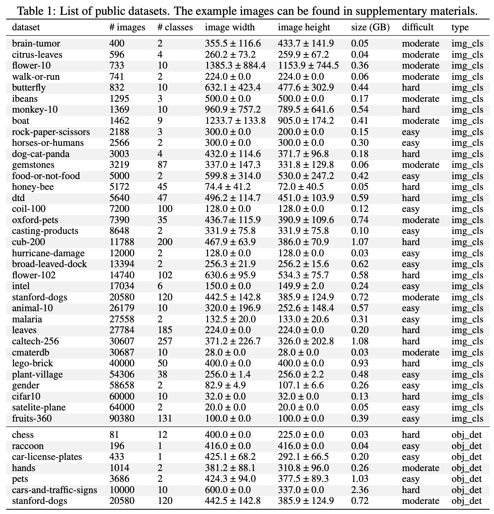
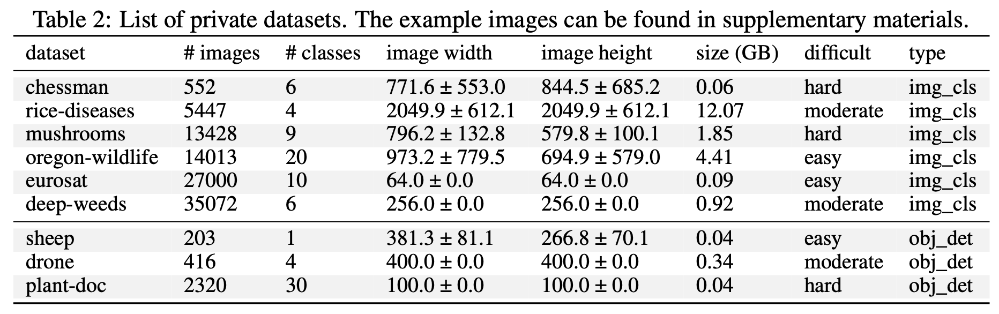
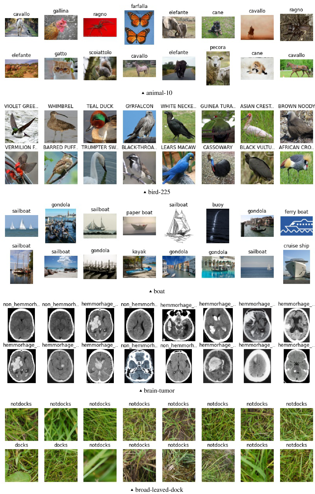
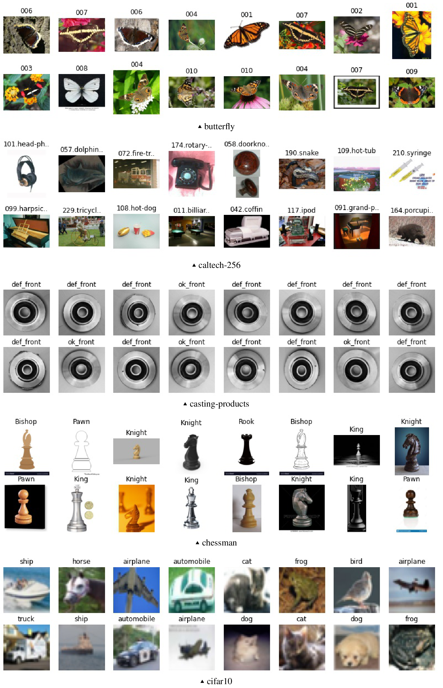

This is the homepage for open source Efficient AutoCV Benchmark designed to incubate highly usable efficient AutoML algorithms designed for computer vision tasks in the wild.

You may use this meta-dataset benchmark to develop and compare the performance of the AutoCV frameworks on datasets collected from diverse domains.

[[pdf]]()[[arxiv]]()

## Introduction

Exploring the optimal hyper-parameters of a deep neural network is a difficult and time-consuming process. Despite the great success of latest computer vision models on controlled vision datasets, the performance of such winning models on wild image datasets is subpar unless heavily tuned given domain datasets. We present a comprehensive Automated CV benchmark for evaluating Automated Machine Learning performance fairly with more real world corner cases covered. Comparing to previous AutoCV challenges, the new benchmark have wider range of # images, # categories, resolutions and unique image domains. For instance, the largest dataset is 1272 times larger than the smallest, the highest image resolution is 2270 and the smallest is 32. Overall we provide 46(40 public, 6 private) datasets for image classification task, 10 (7 public, 3 private) datasets for evaluating object detection task. Finally we present an efficient baseline solution which can be reproduced using the supplementary code repository as a starter kit.

## How to download

## Metrics

## Appendix

Visualization of sample images:

