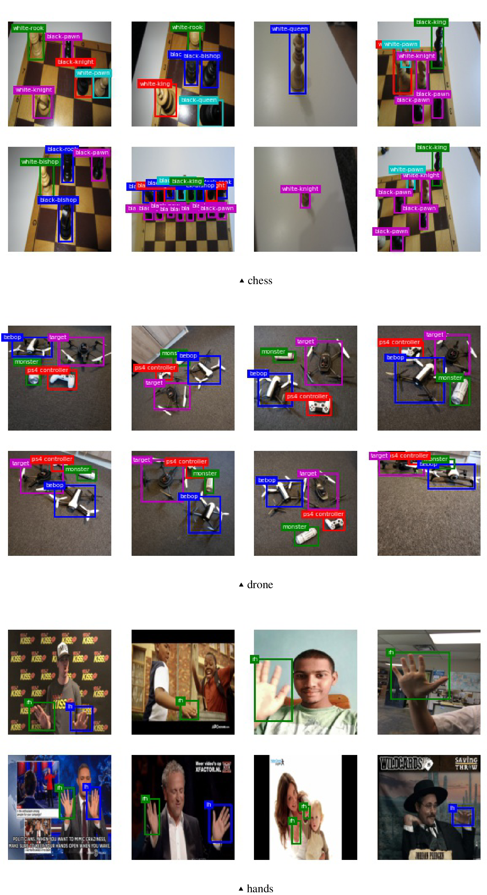

This is the homepage for open source Efficient AutoCV Benchmark designed to incubate highly usable efficient AutoML algorithms designed for computer vision tasks in the wild.

You may use this meta-dataset benchmark to develop and compare the performance of the AutoCV frameworks on datasets collected from diverse domains.

[[pdf]]()[[arxiv]]()

## Introduction

Exploring the optimal hyper-parameters of a deep neural network is a difficult and time-consuming process. Despite the great success of latest computer vision models on controlled vision datasets, the performance of such winning models on wild image datasets is subpar unless heavily tuned given domain datasets. We present a comprehensive Automated CV benchmark for evaluating Automated Machine Learning performance fairly with more real world corner cases covered. Comparing to previous AutoCV challenges, the new benchmark have wider range of # images, # categories, resolutions and unique image domains. For instance, the largest dataset is 1272 times larger than the smallest, the highest image resolution is 2270 and the smallest is 32. Overall we provide 46(40 public, 6 private) datasets for image classification task, 10 (7 public, 3 private) datasets for evaluating object detection task. Finally we present an efficient baseline solution which can be reproduced using the supplementary code repository as a starter kit.

## Download meta-dataset

### Prerequisites

You need a python environment to download all datasets. Make sure you have installed `python>=3.6`, `pip`, please refer to e.g. this [installation guide](https://realpython.com/installing-python/) if you haven't done so.

Install `pandas` and `d8` packages, the easiest way to do so is to install via pip: `python -m pip install pandas d8`.

### Get the script for downloading the datasets

You can use [ipynb](benchmark/download_public_datasets.ipynb) or [python script](benchmark/download_public_datasets.py) to download all images at once.
Make sure you have enough disk space(datasets in total is 40G, recommended free disk space is 100G) and set `ROOT` folder in these script properly before downloading.

Be patient during download and you should run the script in the background thread because it might take longer when internet connection is slow.

### Download the train/test splits for each dataset

You can download the splits from this [zip](benchmark/efficient_autocv_splits.zip) file.

## Metrics

We use normalized Mean Accuracy(m-acc) and Mean Average Precision(mAP) for image classification and object detection tasks follow the conventions, respectively.

For overall score for the entire meta-dataset benchmark, we follow the ALC scoring function introduced in [AutoDL challenges](https://autodl.chalearn.org/), with modified time step normalization function. More specifically, ALC is calculated with formulation:

## Appendix

Visualization of sample images:

